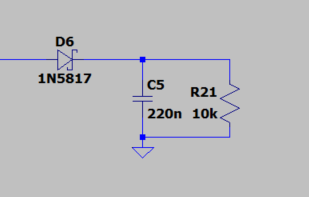

# PV_DC_driver

Sterownik do instalacji PV ogrzewającej zasobnik CWU - zarys teoretyczny bez wyprowadzeń wzorów

  1. [Funkcjonalności](#funkcjonalności)
  2. [Obudowa](#obudowa)
  3. [Sterowanie grzałką MPPT](#sterowanie-grzałką-mppt)
  4. [Pomiar napięcia](#pomiar-napięcia)
  5. [Pomiar prądu](#pomiar-prądu)
  6. [Pomiar Temperatury](#pomiar-temperatury)
  7. [Sterowanie](#sterowanie)

***

## **Funkcjonalności**

- Sterowanie grzałką (włącz / wyłacz) --> MPPT PWM
- Pomiar napięcia
  - na panelu PV
  - na grzałce
- Pomiar prądu
  - na grzałce
- Pomiar mocy
  - obliczony z napięcia i prądu grzałki
- Pomiar temperatury
  - wody w zasobniku CWU
  - w obudowie sterownika / radiatora
- Sterowanie
  - z poziomu sterownika -> wyświetlacz i przyciski
  - przez sieć LAN - strona www lub aplikacja
- Zapis i wizualizacja danych na serwerze
- Hermetyczna obudowa

***

## **Obudowa**

- [Puszka hermetyczna ZP180.120.90JPH TM ABS-PC KRADEX](https://www.tme.eu/pl/details/zp18012090jphabspc/obudowy-uniwersalne/kradex/zp180-120-90jph-tm-abs-pc/) 
  - [Wymiary](https://www.tme.eu/Document/8d2ba81ba6f96d3e10d633a5750ea60b/ZJ-SERIES-7-en.pdf)
- [Radiator aluminiowy](https://allegro.pl/oferta/radiator-p52317-50x150x25mm-2-0k-w-7556032694)
  - Rezystancja termiczna: 2 K/W
  - Wymiary: 150 x 50 x 25 mm
- [Przycisk okrągły monostabilny ](https://allegro.pl/oferta/przelacznik-przyciskowy-metalowy-off-on-2a-250v-8948529496?navCategoryId=67327) 
  - 250V / 2A
  - Podświetlenie LED 2V
  - Otwór montażowy: 16mm
  - Głębokość montażu 20mm
  - Monostabilny
- [Złącze GX12 wtyk + gniazdo](https://allegro.pl/oferta/zlacze-3-pin-0-5mm2-5a-connfly-12125987887) 
  - Otwór montażowy: 12mm
- [Dławica kablowa Ergom E03DK-01030100501](https://allegro.pl/oferta/dlawnica-kablowa-izolacyjna-typu-dp16-gwint-pg16-12284635963) 
  - Typ: PG16
- [GNIAZDO zasilające DC 2,1/5,5mm](https://allegro.pl/oferta/gniazdo-zasilajace-dc-2-1-5-5mm-12119051427)
  - Średnica wewnętrzna styku: 2,1mm
  - Średnica zewnętrzna styku: 5,5mm
  - Otwór montażowy: 8mm
- [Przełącznik z podświetleniem ](https://allegro.pl/oferta/przelacznik-przyciskowy-1-5a-250v-led-16mm-25mm-9974867048?navCategoryId=67327)
  - 250V / 1,5A
  - Podświetlenie LED 2V
  - Otwór montażowy: 16mm
  - Głębokość montażu 25mm
  - Bistabilny
  - [Dokumentacja i wymiary](https://www.tme.eu/Document/587ccce62205a97d234f253cf2faa9ea/r13-508.pdf)
- [Wyświetlacz LCD 16x2 z konwerterem i2c](https://allegro.pl/oferta/wyswietlacz-lcd1602-i2c-konwerter-lcd-niebieski-10014289511?snapshot=MjAyMi0wNi0yOFQxMDozODowNS4zNjZaO2J1eWVyO2Q5Mzg5MWUyMmQ2OGYwMDFlNmVlZDA2OTFhNWRmMzUxMjM0MmYxODE0MmFjZmZjNzY5MzFhMWMwMDJjODUxYmQ%3D)
  - Sterownik: HD44780
  - Konwerter i2c: PCF8574
  - [Dokumentacja i wymiary](https://www.sparkfun.com/datasheets/LCD/ADM1602K-NSW-FBS-3.3v.pdf)
- [Buzzer 12V](https://allegro.pl/oferta/buzzer-buzer-z-generatorem-9-15v-85-db-8371845445)
  - Zasilanie 9-15V
  - Średnica: 12mm
  - Wysokość: 9,5mm

***

## **Sterowanie grzałką MPPT**

***

## **Pomiar napięcia**

- Pomiar napięcia na panelu (kondensatorze buforującym) za pomocą dzielnika napięcia (1:76)
- Wzmacniacz typu RAIL-TO-RAIL w roli bufora napięciowego 
- Filtr RC low-pass o fg=8.84Hz.
- Dla wejściowego napięcia Uwe=250V napięcie wyjściowe wynosi Uwy=3.29V (wg. symulacji)

### *Testy w rzeczywistości*

Tutaj trzeba napisać coś mądrego o tym jak się zachowuje układ pomiarowy w rzeczywistości.
- Jakie są odczyty z ESP32, a jakie z multimetru? (sprawdzić czy multimetr daje radę przy f=10kHz)

***

## **Pomiar prądu**

Peak-detector   

Filtr RC   

- Do pomiaru prądu wykorzystujemy czujnik [ACS712](https://www.sparkfun.com/datasheets/BreakoutBoards/0712.pdf)
  - [Link do sklepu](https://botland.com.pl/czujniki-pradu/14275-czujnik-pradu-acs712-20a-5903351242103.html)
- **Dopóki nie ustalimy jak czujnik zachowuje się przy sygnale PWM (f=10kHz), zostajemy przy pomiarze za pomocą peak-detector'a**

### *Testy w rzeczywistości*

Tutaj trzeba napisać coś mądrego o tym jak się zachowuje układ pomiarowy w rzeczywistości.
- Jakie są odczyty z ESP32, a jakie z multimetru? (sprawdzić czy multimetr daje radę przy f=10kHz)
- Przetestować oba układy i je porównać

***

## **Pomiar Temperatury**

***

## **Sterowanie**
