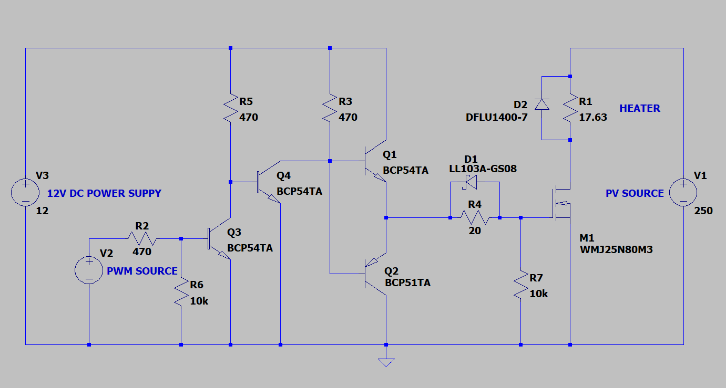
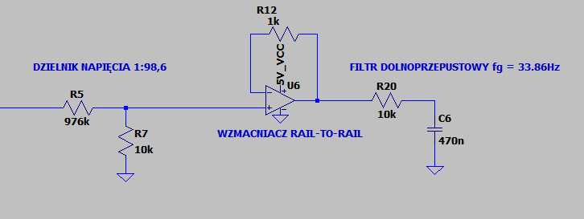
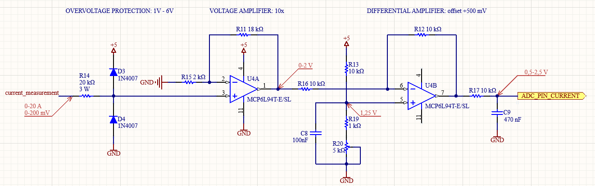

# PV_DC_driver (IN PROGRESS)

Sterownik do instalacji PV ogrzewającej zasobnik CWU - zarys teoretyczny bez wyprowadzeń wzorów

  1. [Funkcjonalności](#funkcjonalności)
  2. [Zasilanie](#zasilanie)
  3. [Obudowa](#obudowa)
  4. [Sterowanie grzałką MPPT](#sterowanie-grzałką-mppt)
  5. [Pomiar napięcia](#pomiar-napięcia)
  6. [Pomiar prądu](#pomiar-prądu)
  7. [Pomiar Temperatury](#pomiar-temperatury)
  8. [Sterowanie](#sterowanie)

***

## **Funkcjonalności**

- Sterowanie grzałką (włącz / wyłacz) --> MPPT PWM
- Zasilanie 12V DC - zewnętrzny zasilacz
- Maksymalne napięcie paneli PV: 250V
- Pomiar napięcia
  - na panelu PV
  - na grzałce
- Pomiar prądu
  - na grzałce
- Pomiar mocy
  - obliczony z napięcia i prądu grzałki
- Pomiar temperatury
  - wody w zasobniku CWU
  - w obudowie sterownika / radiatora
- Sterowanie
  - z poziomu sterownika -> wyświetlacz i przyciski
  - przez sieć LAN - strona www lub aplikacja
- Zapis i wizualizacja danych na serwerze
- Hermetyczna obudowa

***

## **Zasilanie**

Sterownik będzie zasilany z zewnętrznego źródła napięcia 12V DC min. 1A. Zabezpieczenie w postaci bezpiecznika topikowego średniozwłoczngo 800mA 5x20mm.
- [Zasilacz](https://www.tme.eu/pl/details/posc12100a/zasilacze-wtyczkowe/pos/)
- [Bezpiecznik](https://www.tme.eu/pl/details/zkm-0.8a/bezpieczniki-5x20mm-sredniozwloczne/eska/521-016/)

***

## **Obudowa**

- [Puszka hermetyczna ZP180.120.90JPH TM ABS-PC KRADEX](https://www.tme.eu/pl/details/zp18012090jphabspc/obudowy-uniwersalne/kradex/zp180-120-90jph-tm-abs-pc/) 
  - [Wymiary](https://www.tme.eu/Document/8d2ba81ba6f96d3e10d633a5750ea60b/ZJ-SERIES-7-en.pdf)
- [Radiator aluminiowy](https://www.tme.eu/pl/details/rad-a52317_50/radiatory/stonecold/)
  - Rezystancja termiczna: 2 K/W
  - Wymiary: 150 x 50 x 25 mm
- [Przycisk okrągły monostabilny ](https://www.tme.eu/pl/details/ps26bbk/przelaczniki-standardowe/ninigi/) 
  - 250V / 2A
  - Podświetlenie LED 2V
  - Otwór montażowy: 16mm
  - Głębokość montażu 20mm
  - Monostabilny
- [Złącze mikrofonowe GX12 wtyk + gniazdo](https://www.tme.eu/pl/details/ds1110-01-3b6/zlacza-mikrofonowe/connfly/) 
  - Otwór montażowy: 12mm
- [Dławica kablowa PG16](https://www.tme.eu/pl/details/helu-99304/dlawnice/helukabel/ht-pg-16-ral7035/) 
  - Typ: PG16
- [GNIAZDO zasilające DC 2,1/5,5mm](https://www.tme.eu/pl/details/1614-09/zlacza-dc/lumberg/1614-09/)
  - Średnica wewnętrzna styku: 2,1mm
  - Średnica zewnętrzna styku: 5,5mm
  - Otwór montażowy: 8mm
- [Przełącznik z podświetleniem ](https://www.tme.eu/pl/details/r13508bl05brl1/przelaczniki-standardowe/sci/r13-508bl-05-br-l-1/)
  - 250V / 1,5A
  - Podświetlenie LED 2V
  - Otwór montażowy: 16mm
  - Głębokość montażu 25mm
  - Bistabilny
  - [Dokumentacja i wymiary](https://www.tme.eu/Document/587ccce62205a97d234f253cf2faa9ea/r13-508.pdf)
- [Wyświetlacz LCD 16x2 z konwerterem i2c](https://www.tme.eu/pl/details/lcd1602/akcesoria-do-zestawow-uruchomieniowych/kamami/)
  - Sterownik: HD44780
  - [Konwerter i2c: PCF8574](https://www.tme.eu/pl/details/oky3437/moduly-pozostale/okystar/)
  - [Dokumentacja i wymiary](https://www.sparkfun.com/datasheets/LCD/ADM1602K-NSW-FBS-3.3v.pdf)
- [Buzzer 12V](https://www.tme.eu/pl/details/bmt-1212ux/sygnalizatory-elektromag-z-generatorem/bestar/bmt1212ux/)
  - Zasilanie 9-15V
  - Średnica: 12mm
  - Wysokość: 7,5mm

***

## **Sterowanie grzałką MPPT**

Panel PV w pewnym zakresie zachowuje się jak źródło prądowe.
Przy zbyt dużym obciążeniu maleje napięcie i co za tym idzie również moc.
Przy za małym obciążeniu wzrasta napięcie ale maleje prąd, więc również moc.
Trzeba więc tak dostosować obciążenie, żeby wykorzystywana była maksymalna moc paneli w danym momencie.
Nie możemy regulować rezystancji grzałki która jest 'stała', więc musimy regulować prąd.
Profesjonalne falowniki wykorzystują do tego celu przetwornice impulsowe, dzięki którym można regulować napięcie na obciążeniu (w ten sposób również prąd).
Niestety przetwornica o mocy ok 2kW jest zbyt skomplikowana i korzyści z jej zastoswania w naszym projekcie są niewymierne względem czasu i nakładu pracy.
My wykorzystamy sterowanie PWM.

#### Poglądowy układ sterowania grzałką

- Współczynnik wypełnienienia PWM: 70%
- Prąd paneli: 7A
- Rezystancja grzałki: 17,63Ohm

Klucz tranzystorowy będzie przełączał z częstotliwością 10kHz obciążenie, dzięki temu regulując wypełnienie przebiegu prostokątnego będziemy mogli regulować średni prąd płynący przez grzałkę.
Aby zmiany napięcia na panelach PV nie podążały za zmianami napięcia przebiegu PWM trzeba użyć baterii kondensatorów w roli bufora energii.
Gdy grzałka będzie wyłączona, energia z paneli zostanie zgromadzona w kondensatorach (panele doładują kondensatory do ich napięcia).
W momencie włączenia grzałki, kondensatory dostarczą dodatkowy prąd a ich napięcie gwałtownie nie spadnie.
W ten sposób regulować możemy średni prąd obciążenia i średnie napięcie paneli PV.   

Dzięki pomiarom napięcia i prądu poznamy moc z jaką pracuje grzałka. Do szukania optymalnego punktu pracy układu wykorzystamy algorytm napisany w języku Python.   

- Klucz tranzystorowy
  - Dwa równolegle połączone tranzystory N-mosfet [WMJ25N80M3](https://www.tme.eu/pl/details/wmj25n80m3-cyg/tranzystory-z-kanalem-n-tht/wayon/wmj25n80m3/)
  - Izolacja galwaniczna za pomocą transoptora
  - Napięcie sterowania 12V

#### Sterownik tranzystora N-mosfet

Aby zapewnić możliwie szybkie przełączanie klucza tranzystorowego, wykorzystamy bufor / wzmacniacz prądowy , który zapewni dostatecznie wysoki prąd ładowania bramki. Dodatkowy stopień z tranzystorem Q3 służy do odwrócenia sygnału (logiczna '1' -> klucz włączony)

***

## **Pomiar napięcia**

#### Charakterystyka przetwornika ADC w ESP32

Przetwornik ADC w ESP32 nie jest liniowy. Doświadczalnie ustalono, że do wyniku pomiaru należy dodać 130mV (działa w zakresie 130mV - 2500mV)   
**Należy wykonać kalibrację przetwornika ADC!!!**
[Instrukcja kalibracji za pomocą narzędzia 'ESP32_ADC_calibration_tool'](https://github.com/PawelZieba01/PV_DC_driver/tree/main/tools/ESP32_ADC_calibration_tool)

#### Układ pomiarowy napięcia na panelach PV

- Pomiar napięcia na panelu (kondensatorze buforującym) za pomocą dzielnika napięcia (1:98,6)
  - W miarę precyzyjny pomiar napięcia w zakresie 13V - 250V (zakładamy maks. napięcie 250V, natomiast poniżej napięcia 40V wyłączamy grzanie wody)
  - Wartości rezystorów muszą być spore, aby nie płynęły duże prądy
  - R1=976kOhm, R2=10kOhm
  - Dla wejściowego napięcia Uwe=250V napięcie wyjściowe wynosi Uwy=2.535V (wg. symulacji)
- Wzmacniacz typu RAIL-TO-RAIL w roli bufora napięciowego 
- Filtr RC low-pass o fg=33.86Hz (R=10kOhm, C=470nF)

### *Testy w rzeczywistości*

**Testy przeprowadzimy na gotowym prototypie sterownika z dołączonymi panelami.**   
Na ten moment wiadomo, że filtr RC (R=10kOhm, C=470nF) zachowuje się prawidłowo przy f=10kHz

***

## **Pomiar prądu**

> ### **W TRAKCIE TESTÓW**
> #### Filtr RC do pomiaru przebiegu napięcia z przetwornika prądu ACS712
>  
> - Do pomiaru prądu wykorzystujemy czujnik [ACS712](https://www.sparkfun.com/datasheets/BreakoutBoards/0712.pdf)
>   - [Link do sklepu](https://botland.com.pl/czujniki-pradu/14275-czujnik-pradu-acs712-20a-5903351242103.html)
> - Filtr RC low-pass o fg=33.86Hz (R=10kOhm, C=470nF)
> - *ACS712 może mierzyć prąd płynący w obie strony. Dla prądu 0A na wyjściu ustawia 2,5V. Ponieważ ESP32 pracuje z logiką 3.3V podłączymy przetwornik prądu **'odwrotnie'** (0-20A -> 2,5 - 0,5V), dzięki temu nie przekroczymy wartości 3.3V na wejściu uC i będziemy pracować w liniowym zakresie przetwornika ADC. Dodatkowo jeśli prąd nie przekroczy 23A to nie wyjdziemy poza liniowy zakres ADC (<130mV)*

> ### **W TRAKCIE TESTÓW**   
> 
> - Do pomiaru prądu płynącego przez grzałkę, wykorzystamy rezystor 10mOhm w postaci bocznika szeregowego.
> - Filtr RC low-pass o fg=33.86Hz (R=10kOhm, C=470nF)
> - Za pomocą wzmacniacza nieodwracającego wzmocnimy sygnał 10 razy i przesuniemy (oraz odwrócimy) sygnał o 0,5V w górę (2,5V - 0,5V  -->  0A - 20A), dzięki temu będziemy pracować w liniowym zakresie ADC.

### *Testy w rzeczywistości*

- Pomiar prądu za pomocą układu ACS712 działa dużo lepiej przy częstotliwości PWM 3kHz (zamiast 10kHz)
- Filtr RC (R=10kOhm, C=470nF) i kalibracja ADC działają przy f=3kHz
- ACS712 testowany na płytce stykowej ma dużą czułość na zakłócenia zewnętrzne (w tym dotykanie go)
- Uzyskana dokładność pomiaru (napięcie) ok. 100mV (ok. 1A)

**Zaprojektowany zostanie obwód PCB z torami pomiarowymi (ACS712 i bocznik szeregowy) - okaże się, która metoda pomiaru jest będzie lepsza**

***

## **Pomiar Temperatury**

- Temperatura wody w boilerze mierzona za pomocą czujnika [DS18B20](https://www.tme.eu/pl/details/df-dfr0198/czujniki-srodowiskowe/dfrobot/dfr0198/) w hermetycznej obudowie
  - W celu zmniejszenia ryzyka błędnego odczytu (gdyby czujnik uległ uszkodzeniu) zastosowane zostaną dwa takie czujniki
  - Montaż za pomocą wtyków GX12
- Pomiar temperatury wewnątrz obudowy/radiatora również za pomocą DS18B20

***

## **Sterowanie**

***
