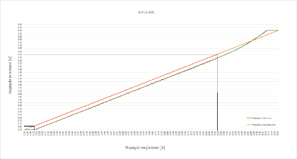
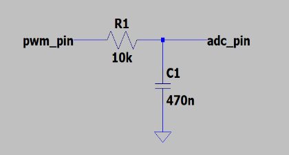
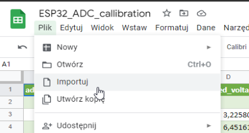
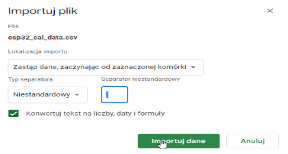
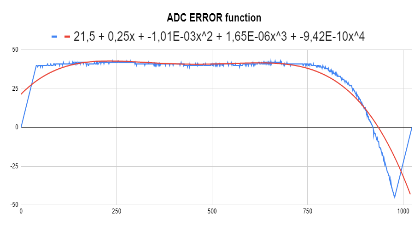
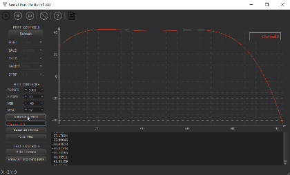

# ESP32 ADC calibration tool [micropython]

### Narzędzie służące do kalibracji przetwornika ADC w mikrokontrolerze ESP32 / ESP8266(nietestowane)

#### Charakterystyka przetwornika ADC w ESP32

Przetwornik ADC w ESP32/8266 jest nieliniowy i wymaga kalibracji w celu poprawienia jego właściwości.   
Opisywana procedura kalibracyjna jest jedną z kilku metod kalibracji, polega na znalezieniu funkcji błędu przetwornika ADC   
i skompensowaniu odczytywanych wartośći programowo. **Niestety kalibracji należy dokonywać ręcznie, każdorazowo przy zmianie mikrokontrolera**.

- Odczyty pokrywają się z przewidywanymi wartościami w zakresie ok. 200mV - 3000mV (w granicy błędu)
- Kalibracji należy dokonywać osobno dla każdego mikrokontrolera
- Obliczenie błędu przez mikrokontroler może trwać zbyt długo (zależy od zastosowania)
- Na moment obecny narzędzie wspiera kalibrację przetwornika ADC o rozdzielczości 10-bitów z zakresem 0-3.3V (tłumienie 11dB)

***

## **Wymagania**

- ESP32/8266 z filtrem RC
- Edytor [Thonny](https://thonny.org/) (zalecany)
- Program [serial_port_plotter](https://github.com/CieNTi/serial_port_plotter)
- [Arkusz kalibracyjny](https://docs.google.com/spreadsheets/d/1wJlqRDmtxAtFvUfqmPdQIQIgYwRd36lFMD4gYKm5iSI/edit#gid=0) 
(**arkusza kalibracyjnego należy używać tylko przez 'arkusze google', 'Microsoft Excel' nie współpracuje**)

***

## **Sposób kalibracji**

### **1. Podłączenie filtru RC do ESP32/8266**

Wartości R1 i C1 należy dobrać na podstawie częstotliwości sygnału PWM. Dla 10kHz(PWM) częstotliwość graniczna filtru (R1=20kOhm, C1=470nF) wynosi 33.86Hz.   
Musi ona być odpowiednio mniejsza od częstotliwości PWM. Właściwe dobranie filtru zapewni małe tętnienia sygnału mierzonego i zadawalający czas odpowiedzi.

### **2. Przygotowanie i wgranie programu kalibracyjnego do ESP32/8266**

W kodzie programu należy odpowiednio zmodyfikować sekcję 'CONFIG'.

    ##----------------------------- CONFIG -----------------------------##

    adc_pin = 34         #Pin przetwornika ADC -> wyjście filtru RC
    pwm_pin = 21         #Pin PWM -> wejście filtru RC
    pwm_freq = 10000     #Częstotliwość sygnału PWM

    ##------------------------------------------------------------------##

Za pomocą edytora Thonny należy wgrać odpowiednio zmodyfikowany program 'tools/adc_callibration_tool/**main.py**'.   
**Po zakończeniu pomiarów należy pobrać z pamięci ESP plik 'esp32_cal_data.csv'.**

### **3. Zaimportowanie danych do arkusza kalkulacyjnego i znalezienie wzoru funkcji błędu**

Pobrane dane muszą zostać zaimportowane do arkusza kalkulacyjnego google [ESP32_ADC_callibration](https://docs.google.com/spreadsheets/d/1wJlqRDmtxAtFvUfqmPdQIQIgYwRd36lFMD4gYKm5iSI/edit#gid=0) w miejsce pierwszej komórki (zaznaczyć komórkę A1).

Podczas importowania pliku należy wybrać opcję **'Zastąp dane, zaczynając od zaznaczonej komórki'**, typ separatora **'Niestandardowy'**,   
w pole 'Separator niestandardowy' wpisać jedną **SPACJĘ**, oraz zaznaczyć **'Konwertuj tekst na liczby, daty i formuły'**

Następnie odpowiednio dopasować ustawienia linii trendu w jej opcjach, tak aby możliwie dobrze pokrywała się z wykresem błędu.

**Po wykonaniu powyższych czynności nad wykresem błędu znajdzie się zaktualizowany wzór przybliżonej funkcji błędu.**

### **3. Zmodyfikowanie i przetestowanie funkcji obliczającej błąd w pliku main.py**

W pliku 'tools/adc_callibration_tool/**main.py**' należy zmodyfikować funkcję **'calculate_adc_error'** według odczytanego wzoru przybliżonej funkcji błędu.

    # Funkcja obliczająca różnicę na podstawie dopasowanej funkcji błędu,
    # należy zmodyfikować wg. arkusza excel i przekopiować do docelowego programu :)
    ## -------------------------------------------------------------------------------- ##
    def calculate_adc_error(adc_value):
        return (21.5
                +  (0.25 * adc_value)
                +  (-0.00101 * adc_value * adc_value)
                +  (0.00000165 * adc_value * adc_value * adc_value)
                +  (-0.000000000942 * adc_value * adc_value * adc_value * adc_value))
    ## -------------------------------------------------------------------------------- ##

Aby przetestować poprawność działania powyższej funkcji należy zakomentować/odkomentować według poniższego wzoru sekcję 'PROGRAM'.

    ## ---------------------------------------------- PROGRAM ---------------------------------------------- ##

    #get_calibrate_data()    #Zebranie danych do pliku .csv
    check_calculations()     #Sprawdzenie czy znaleziona funkcja matematyczna działa poprawnie (wymaga programu serial_port_plotter)

    ## ----------------------------------------------------------------------------------------------------- ##

Po uruchomieniu tak zmodyfikowanego programu **w ciągu 10 sekund** należy:

1. zamknąć program Thonny
2. Uruchomić program 'serial_port_plotter'
3. Połączyć się z ESP32/8266 

Po 10 sekundach od uruchomienia programu 'main.py' ESP zacznie wysyłać dane na port szeregowy. Powinny one pojawić się na wykresie w ploterze.
Jeśli kształt naryswanej funkcji zgadza się z linią trendu (z arkusza google) to pomyślnie znaleziono wzór funkcji błędu.

### **4. Użycie funkcji 'calculate_adc_error' we własnym programie**

Po pomyślnej 'kalibracji' można przekopiować funkcję 'calculate_adc_error' do własnego programu i za jej pomocą kompensować dane odczytywane z przetwornika ADC. **Funkcja zwraca obliczoną różnicę, którą należy dodać do odczytanego pomiaru.**

***

Autor: Paweł Zięba
